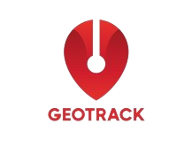

# Geotrack
Geotrack é uma solução para o rastreamento de frotas, implementando uma arquitetura robusta e escalável que garante visualização e gerenciamento intuitivo de coordenadas visitadas por usuários portadores de dispositivos móveis.



Buscamos proporcionar uma solução abrangente e confiável para rastreamento e geolocalização. Nosso foco está em garantir segurança, privacidade e desempenho excepcionais para todos os nossos usuários.

# Features principais
- Cadastro e acesso de usuários
- Cadastro e gerenciamento de dispositivos móveis
- Cadastro e gerenciamento de veículos
- Armazenamento de coordenadas
- Demonstração de pontos de coordenada percorridos por veículos em mapa interativo
- Gerenciamento de filas de mensagens

# Features secundárias 
- APIs de gerenciamento e demais operações CRUDs
- Controle de migrações de base de dados

# Como rodar

O projeto tem dependências em várias aplicações e serviços que precisam estar operantes para garantir o bom funcionamento da aplicação.
As aplicações relacionadas podem ser iniciadas de forma automatizada por meio do arquivo batch, caso esteja utilizando um computador windows.
``` 
run.bat
```
# Tecnologias usadas
- Python

# Pré-requisitos
- Django na versão 5.0.3v
- Mosquitto MQTT 2.0.18v
- RabbitMQ 3.13.1v
- Erlang 26.2.4v

# Autor
- João Vitor de Rossi Figueiredo - [JoaoRossi49](https://github.com/JoaoRossi49)

# Referências
- [Eclipse Mosquitto](https://mosquitto.org/download/)
- [RabbitMQ](https://www.rabbitmq.com/docs/download)
- [Erlang](https://www.erlang.org/downloads)
